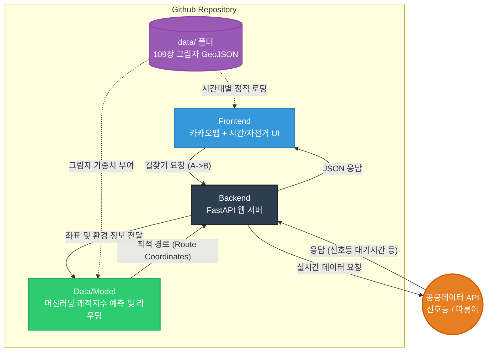

# 🌞 Shadow-Nav (그늘길 내비게이션)

2026년 전국 통합데이터 활용 공모전 출품작

폭염 및 기후위기 심화에 대응하여, 보행자와 자전거 이용자에게 **가장 시원한(그늘진) 최적의 테마 경로**와 **공공 교통 인프라 정보(신호등, 자전거)**를 실시간 융합 제공하는 스마트 웹 내비게이션 프로토타입입니다.

---

## 🛠 Tech Stack (기술 스택 확정)

팀원 간 개발 환경 통일을 위해 아래의 스택을 공식으로 사용합니다.

*   **Frontend (웹 UI & 지도):** HTML5, CSS, Vanilla JS + **카카오맵 API (Kakao Maps API)** (국내 지도/장소 검색 완벽 지원)
*   **Backend (API & 서버):** Python + **FastAPI** (성능이 가장 빠르고 API 문서가 자동 생성되므로 데이터 넘기기 최적)
*   **Data & Model (핵심 알고리즘):** GeoPandas, Shapely, Suncalc, **OSMnx** (보행망 탐색), **Scikit-learn** (머신러닝 쾌적지수 예측 모델)

---

## 🏗 System Architecture (시스템 구조도)



---

## 📁 Repository Structure & Roles (역할 분담)

본인의 폴더 외의 파일은 가급적 건드리지 않고 PR(Pull Request)을 통해 작업합니다.

### `frontend/` (팀원 A 전용)
*   **역할:** 사용자 화면(UI) 및 카카오맵 기반 시각화
*   **작업 포인트:** `index.html`에 카카오맵을 띄우고, 자전거 체크박스와 시간 슬라이더 UI 구현. 장소 검색 API(Local)를 통해 출발/도착지를 잡고, `data/` 안의 그림자와 백엔드의 경로를 지도에 오버레이.

### `backend/` (팀원 B, C 핵심 구역)
*   **역할:** 외부 API 통신 및 코딩 두뇌 (FastAPI, Python)
*   `app.py` **(팀원 C)**: FastAPI를 가동하여 프론트방과 모델방의 다리 역할을 수행. 공공데이터포털(신호등, 자전거) REST API 호출 및 데이터 파싱.
*   `route_model.py` **(데이터 사이언티스트/본인)**: `OSMnx`로 보행그래픽스를 빌드하고 머신러닝 기반의 **쾌적 지수 예측 점수(Comfort Index)**를 다익스트라(Dijkstra) 라우팅 알고리즘에 적용하여 `app.py`에 납품.

### `data/` (공통 자산 구역)
*   폭염 기준일(8/1) 오전 9시~오후 6시 5분 간격 109장의 사전 시뮬레이션 그림자 데이터 및 3D 모델링 원본 등 프로젝트 에셋이 위치합니다.

---

## 🚀 How to Start (시작 방법)

1. 리포지토리 클론 
   ```bash
   git clone https://github.com/msjoon0811/shadow-nav.git
   ```
2. 각자 본인의 브랜치 만들기 (제발 `main` 브랜치에서 직통으로 작업 금지!)
   ```bash
   git checkout -b feature/본인이름_또는_기능
   ```
3. 작업 완료 후 Commit & Push, 그리고 Github 웹사이트에서 **Pull Request** 생성하여 리뷰 후 합치기!
