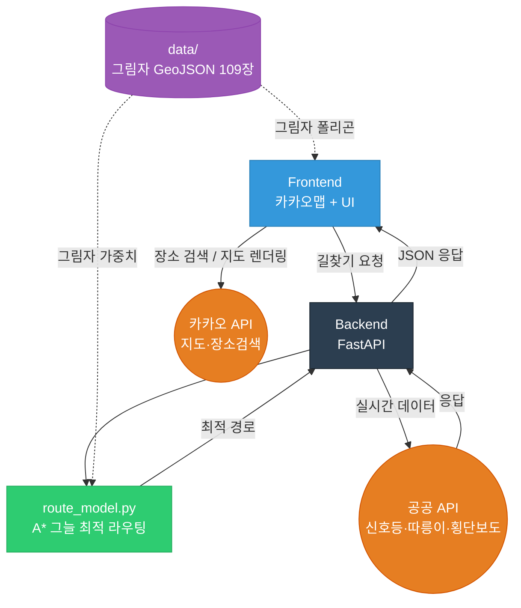

# Shadow-Nav (그늘길 내비게이션)

2026년 전국 통합데이터 활용 공모전 출품작

폭염 및 기후위기 심화에 대응하여, 보행자와 자전거 이용자에게 **가장 시원한(그늘진) 최적 경로**와 **공공 교통 인프라 정보(신호등, 따릉이)**를 실시간 융합 제공하는 스마트 웹 내비게이션 프로토타입입니다.

---

## 기술 스택

| 영역 | 기술 |
| :--- | :--- |
| **Frontend** | HTML5, CSS, Vanilla JS, 카카오맵 JS API |
| **Backend** | Python, FastAPI, httpx (비동기 API 호출) |
| **Routing Model** | OSMnx, NetworkX (A*), GeoPandas, Shapely |

---

## 활용 데이터 및 외부 API

### 정적 데이터 (`data/` 폴더)

| 데이터 | 출처 | 설명 |
| :--- | :--- | :--- |
| 시간대별 그림자 GeoJSON (109장) | V-World 3D 건물 통합정보 (국토교통부) | 신논현역 반경 건물 기반 시뮬레이션 완료 |
| 보행/자전거 도로망 그래프 | OpenStreetMap (OSMnx) | A* 라우팅용 도로망 |

### 실시간 API

| API | 출처 | 용도 |
| :--- | :--- | :--- |
| 카카오맵 JS API | Kakao Developers | 지도 렌더링, 경로·마커 표시 |
| 카카오 Local API | Kakao Developers | 장소명 → 위경도 변환, 검색 자동완성 |
| 교통안전 신호등 실시간 정보 | 공공데이터포털 | 보행자 신호 잔여시간 → 라우팅 패널티 반영 |
| 서울시 따릉이 실시간 대여소 | 서울 열린데이터광장 | 자전거 모드 시 근처 대여소·잔여 대수 표시 |
| 서울시 횡단보도 위치 데이터 | 서울 열린데이터광장 | 횡단보도 제약 라우팅 |

---

## 시스템 구조



---

## 핵심 라우팅 로직

1. **카카오 모빌리티 API**로 기본 경로 및 bbox 획득
2. OSMnx로 해당 bbox 보행 도로망 다운로드
3. 시간대별 그림자 GeoJSON으로 각 엣지의 그늘 비율 계산 → `shadow_weight` 부여
4. 횡단보도 제약 적용
   - 서울시 횡단보도 API + OSM `highway=crossing` 노드 병합
   - shapely `crosses()`로 실제 차도 횡단 엣지 감지 → 비횡단보도 횡단 시 60분 패널티
5. 신호등 잔여시간 패널티 적용 (`stop-And-Remain` 상태만, 300초 이하만)
6. **A* 알고리즘**으로 최적 경로 탐색
7. 실패 시 카카오 경로 fallback

---

## 환경 설정

`backend/.env` 파일 작성:

```env
KAKAO_REST_API_KEY=...   # 카카오 REST API 키
KAKAO_JS_API_KEY=...     # 카카오 JavaScript API 키
SIGNAL_API_KEY=...       # 공공데이터포털 신호등 API 키
DDAREUNGI_API_KEY=...    # 서울 열린데이터광장 인증키
SEOUL_API_KEY=...        # 서울 열린데이터광장 인증키 (횡단보도)
```

카카오 개발자 콘솔 → 앱 → 플랫폼 → Web에 `http://localhost:3000` 등록 필요

---

## 실행 방법

```bash
# 의존성 설치
pip install -r backend/requirements.txt

# 백엔드 실행 (터미널 1)
cd backend
uvicorn app:app --port 8002

# 프론트엔드 실행 (터미널 2)
cd frontend
python -m http.server 3000
```

브라우저에서 `http://localhost:3000` 접속

---

## 주요 제약 사항

- 그림자 데이터 커버 범위: **도곡/대치동 일대 약 1km²** (lat 37.4996~37.5091, lng 127.0190~127.0307)
  - 이 범위 안에서 출발/도착을 설정해야 그늘 최적화 경로 확인 가능
- OSM 한국 데이터 품질 한계로 그림자 폴리곤 위치가 카카오맵 건물과 약간 어긋남
