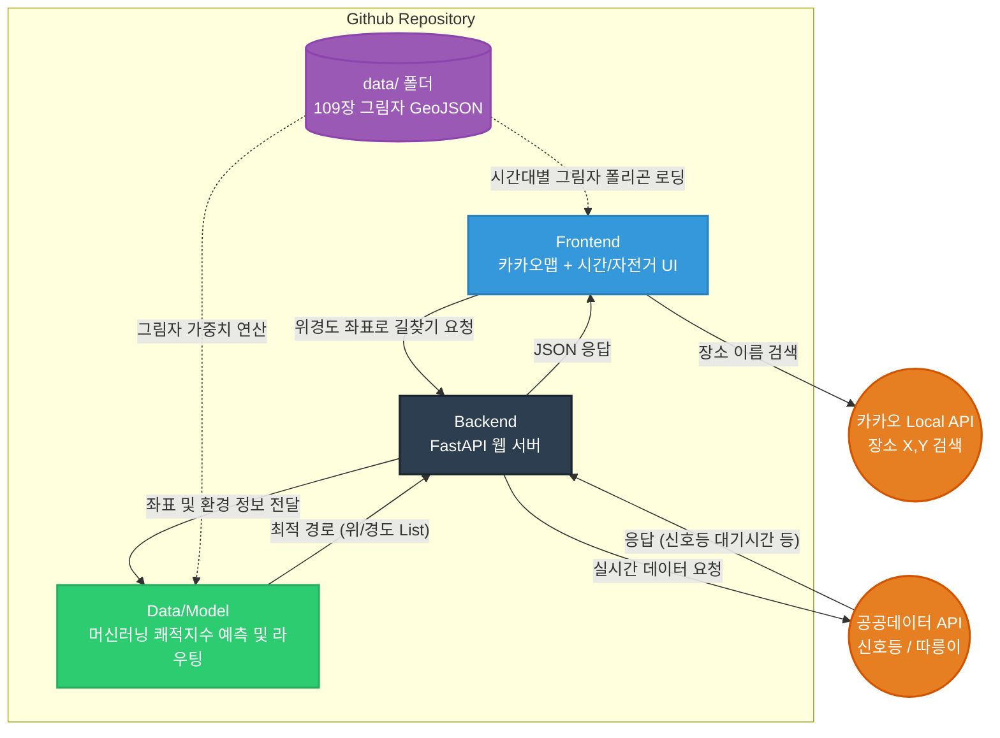

# 🌞 Shadow-Nav (그늘길 내비게이션)

2026년 전국 통합데이터 활용 공모전 출품작

폭염 및 기후위기 심화에 대응하여, 보행자와 자전거 이용자에게 **가장 시원한(그늘진) 최적의 테마 경로**와 **공공 교통 인프라 정보(신호등, 자전거)**를 실시간 융합 제공하는 스마트 웹 내비게이션 프로토타입입니다.

---

## 🛠 Tech Stack (기술 스택 확정)

*   **Frontend (웹 UI & 지도):** HTML5, CSS, Vanilla JS + **카카오맵 API (Kakao Maps API)**
*   **Backend (API & 서버):** Python + **FastAPI** (성능 최적화 및 Swagger UI 자동 생성용)
*   **Data & Model (예측 알고리즘):** GeoPandas, Shapely, Suncalc, **OSMnx**, **Scikit-learn** (K-Means/RandomForest)

---

## 💾 프로젝트 활용 데이터 및 외부 API 명세서

팀원들은 각자 담당하는 API의 공식 홈페이지에 가입하여 API Key를 발급받아 테스트하시기 바랍니다.

### 1. 사용되는 정적 데이터 (내부 자산 - `data/` 폴더)
| 데이터명 | 출처 | 활용 목적 |
| :--- | :--- | :--- |
| **V-World 3D 건물 통합정보** | 국토교통부 | 신논현역 반경 500m 건물 1,414개 높이 기반 **시간대별 109장 그림자 GeoJSON 생성 완료** |
| **보행자/자전거 도로망 그래프** | OpenStreetMap (OSMnx) | 길찾기 알고리즘이 돌아갈 실제 골목길(Edge) 및 교차로(Node) 좌표망 구축 (1,232개 도로) |

### 2. 프론트엔드 호출 API (팀원 A 담당)
| 통신 인터페이스 지정 | 출처 | 활용 목적 |
| :--- | :--- | :--- |
| **Kakao Maps API (Javascript)** | Kakao Developers | 웹 브라우저에 한글 지도를 띄우고, 백엔드가 보내준 경로 선분과 각종 마커 그리기 |
| **Kakao Local API (Geocoding)** | Kakao Developers | 사용자가 "강남역"이라고 검색했을 때 위도/경도(X,Y) 좌표로 변환해 주기 |

### 3. 백엔드 실시간 호출 API (팀원 C 담당)
| 통신 인터페이스 지정 | 출처 | 활용 목적 |
| :--- | :--- | :--- |
| **교통안전 신호등 실시간 정보 API** | 공공데이터포털 | 신논현역 주변 경로상 교차로 횡단보도의 **빨간불 잔여 대기시간(초)**을 불러와서 라우팅 모델 패널티에 반영 |
| **서울시 따릉이 실시간 대여소 정보 API** | 서울 열린데이터 광장 | 사용자가 '자전거' 옵션 체크 시, 경로상 가장 가까운 대여소와 **실시간 잔여 자전거 대수** 파악 |

---

## 🏗 System Architecture (시스템 구조도)



---

## 📁 Repository Structure & Roles (역할 분담 상세 가이드)

### `frontend/` (팀원 A: 웹 UI 및 지도 렌더링)
1. **Kakao Developers**에서 애플리케이션 생성 후 **JavaScript API 키**와 **REST API 키(장소검색용)**를 발급받으세요.
2. `index.html`에 카카오맵을 띄웁니다.
3. 출발지/도착지 입력칸, '자전거 이용자 전용' 체크박스, **시간대 조절 슬라이더(09:00 ~ 18:00)** UI를 만듭니다.
4. 사용자가 출발지를 검색하면 Kakao Local API를 통해 좌표를 알아내어 백엔드로 (X, Y) 값을 쏴줍니다.
5. 백엔드에서 빙글빙글 돌아온 '최적의 경로 좌표 리스트'를 지도 위에 파란색 선으로 그립니다.

### `backend/` (팀원 B, C 핵심 구역)
1. **팀원 C (API 연동 및 백엔드 서버):** 
   - `app.py`에서 **FastAPI** 서버를 가동합니다.
   - 공공데이터포털(신호등)과 서울 열린데이터 광장(따릉이)에서 API 키를 발급받으세요.
   - 파이썬 `requests` 등으로 데이터를 호출하는 코드를 작성하고, 그 정보들을 모델(route_model.py)로 넘겨줍니다. 프론트엔드와 통신하는 징검다리 역할을 합니다.
2. **나/팀장 (데이터 모델 & 머신러닝):** 
   - `route_model.py`에서 작업합니다.
   - OSMnx 도로망과 그림자 데이터를 결합하여 **도로별 쾌적도 비지도학습 클러스터링(AI)**을 수행합니다. 
   - 쾌적도가 반영된 도로 위에서 다익스트라 경로 탐색 알고리즘을 가동하여 가장 시원한 길을 찾아 `app.py`로 리턴해 줍니다.

---

## 🚀 How to Start (시작 방법)

1. 리포지토리 클론 
   ```bash
   git clone https://github.com/msjoon0811/shadow-nav.git
   ```
2. **(매우중요)** 절대 `main` 브랜치에 직접 코드를 Push하지 마세요! 각자 본인의 브랜치를 파서 작업합니다.
   ```bash
   git checkout -b feature/본인이름_또는_기능
   ```
3. 작업 완료 후 Commit & Push 하시고, Github 웹사이트에서 **Pull Request (PR)** 를 생성해서 서로의 코드를 리뷰한 뒤 Merge 합니다.

---

## 💡 핵심 동작 시나리오 및 데이터 흐름 상세 (Step-by-Step)

팀원들의 전체적인 시스템 이해도를 높이기 위해, 사용자가 앱을 켜고 목적지에 도착할 때까지 내부에서 코드가 어떻게 맞물려 돌아가는지 세세하게 설명합니다.

**[상황 예시]** 여름철 오후 2시, 사용자가 신논현역에서 강남역까지 **'자전거'**를 타고 가장 시원한 길로 가고 싶을 때

### 🟢 STEP 1: 프론트엔드 (UI 조작 및 검색) - `frontend/app.js`
1. 사용자가 브라우저에서 화면을 엽니다. 카카오맵 API가 로딩되어 신논현 일대 지도가 뜹니다.
2. 사용자가 출발지 입력창에 '신논현역', 도착지에 '강남역'을 타이핑합니다.
3. 프론트엔드 코드가 **Kakao Local API**를 호출하여 글자를 위/경도 좌표(X, Y)로 변환합니다.
4. 사용자가 '자전거 이용' 체크박스에 체크하고, 시간 슬라이더를 '14:00'에 맞춘 뒤 길찾기 버튼을 누릅니다.

### 🟡 STEP 2: 백엔드 (요청 수신 및 외부 API 핑퐁) - `backend/app.py`
1. 길찾기 요청이 FastAPI 서버(`app.py`)로 들어옵니다. 요청에는 [출발/도착 좌표, 자전거 여부, 14:00] 정보가 담겨 있습니다.
2. FastAPI 서버는 즉시 2개의 **공공데이터 API**에 비동기(동시) 요청을 날립니다.
   - **경찰청 신호등 API:** "지금 강남대로 횡단보도 빨간불 몇 초 남았어?" -> (응답: "A 횡단보도는 30초, B 횡단보도는 10초")
   - **따릉이 API (자전거 체크 시):** "신논현역 앞 따릉이 대여소에 재고 있어?" -> (응답: "3대 있음")

### 🔴 STEP 3: 모델링 (데이터 융합 및 쾌적 지수 계산) - `backend/route_model.py`
1. 백엔드가 전달해준 모든 정보를 `route_model.py` (AI 두뇌)가 넘겨받습니다.
2. 자전거를 탄다고 했으므로, 기존에 저장해둔 **자전거용 도로망(`data/bike_graph.graphml`)**을 불러옵니다.
3. 14:00라는 시간에 맞춰, 사전에 시뮬레이션해 둔 **오후 2시 그림자 데이터(`shadow_0801_1400.geojson`)**와 **자전거 도로망**의 교집합을 기하학적으로 연산하여, 어떤 골목길이 얼마나 그늘져 있는지 비율(%)을 뽑아냅니다.
4. 건물 그림자 비율, 언덕길 여부(경사도) 등의 공간 특성들을 파이썬 **Scikit-learn (머신러닝) 모델**에 넣습니다. AI가 눈 깜짝할 새에 1,000개의 골목길 각각에 **"쾌적 지수 점수 (0~100점)"**를 매깁니다.
5. 이 점수판 위에 다익스트라(Dijkstra) 라우팅 알고리즘을 굴립니다. 신호 대기시간이 길거나 땡볕 언덕길은 패널티를 주고, 그늘진 평지는 가산점을 줍니다.
6. 그렇게 해서 도출된 "가장 빠르면서도 시원한 최적의 우회 경로 좌표 덩어리" 1개를 리스트업 합니다.

### 🔵 STEP 4: 화면 표시 (응답 및 시각화) - `frontend/app.js`
1. 최적 경로 좌표가 FastAPI를 거쳐 다시 프론트엔드(웹 브라우저)로 돌아옵니다.
2. 프론트엔드는 이 좌표를 따라 카카오맵 위에 예쁜 **파란색 선(Polyline)**을 그어줍니다.
3. 따릉이 API에서 받아온 결과를 바탕으로, 잔여 자전거 대수가 말풍선 툴팁으로 지도에 표시됩니다.
4. 사용자는 시원한 그림자 애니메이션이 깔려있는 지도에서, 최적의 자전거 길 안내를 받게 됩니다!
